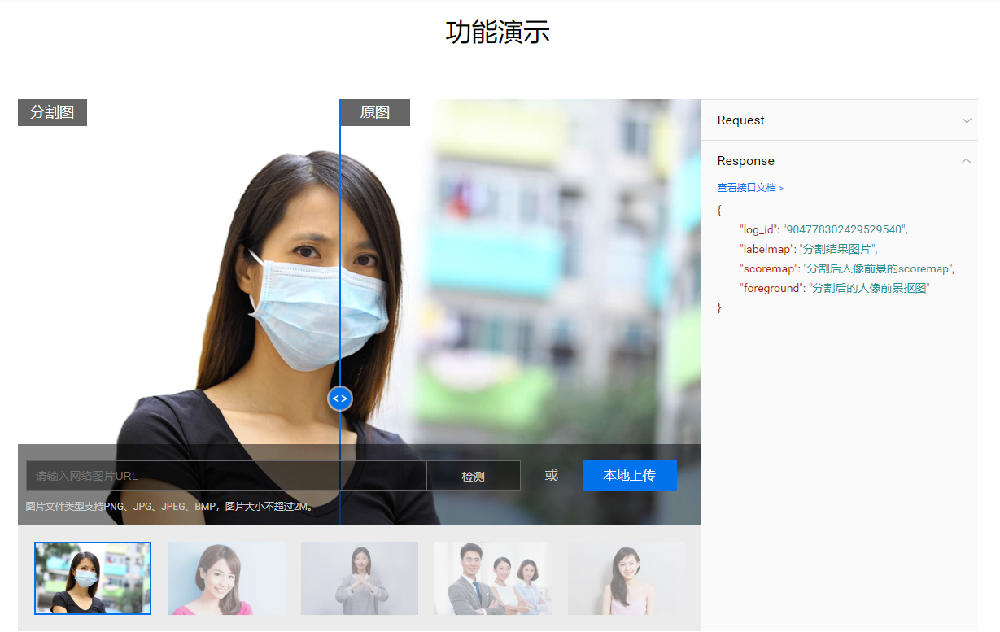
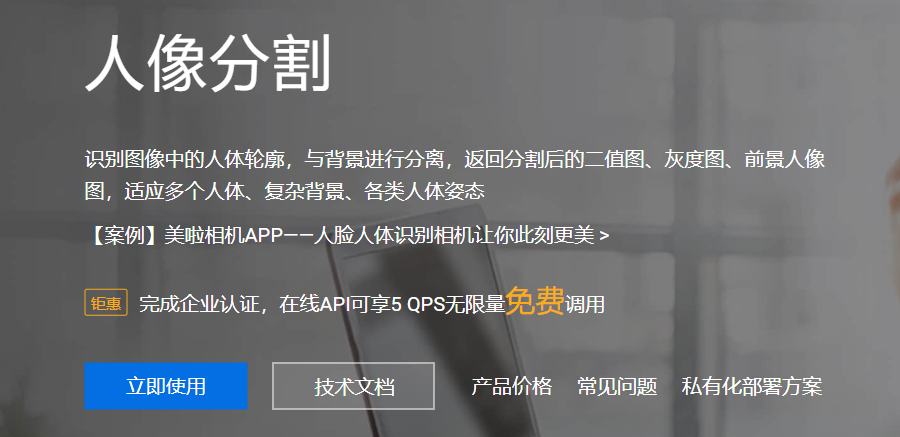
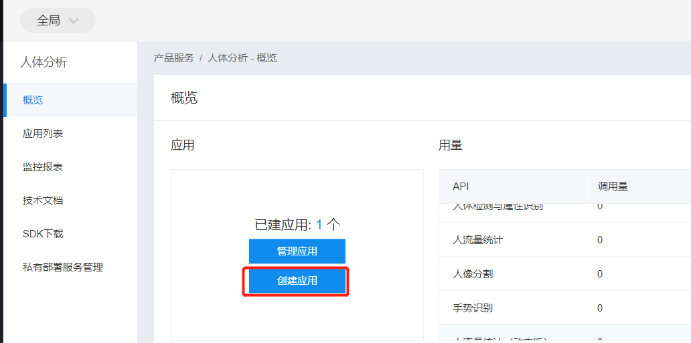
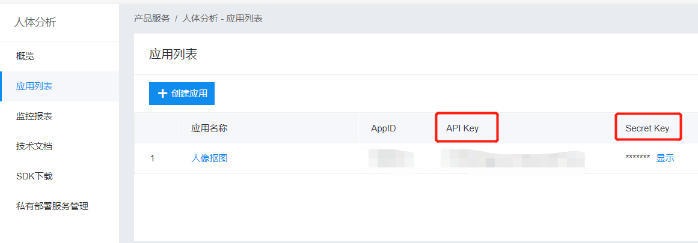
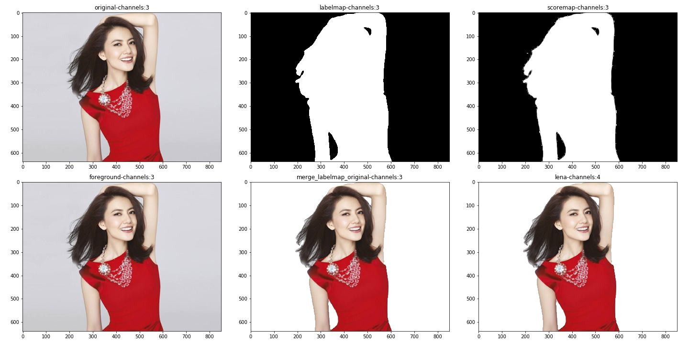
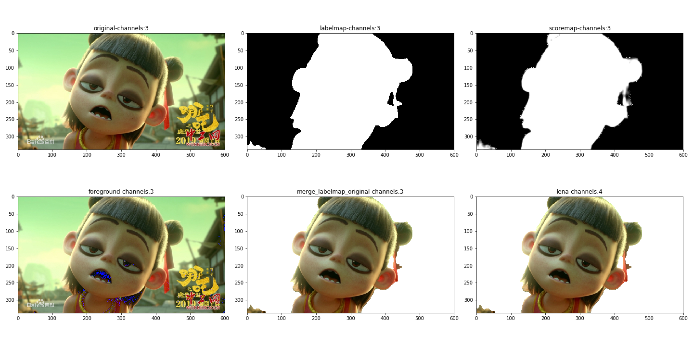
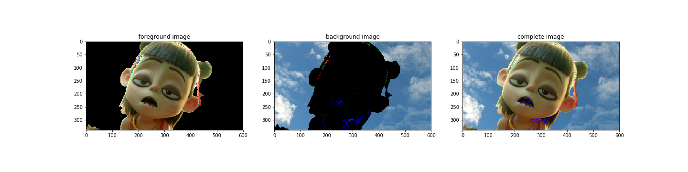

# 
[百度AI人像抠图](https://ai.baidu.com/tech/body/seg)

## 人像分割

本文介绍$\color{blue}{百度AI人像分割}$功能

识别图像中的人体轮廓，与背景进行分离，返回分割后的二值图、灰度图、前景人像图，适应多个人体、复杂背景、各类人体姿态

每天可以免费处理5万次，足够普通用户使用

## 使用流程

1.选择"立即使用"进入百度智能云-管理中心界面

2.在百度智能云-管理中心创建“人像分割”应用，简单填写下应用名称及应用描述即可

3.获取创建app对应的API Key及Secret Key

4.点击步骤1中的技术文档，参考文档中的“调用方式”获取access_token，参考“人像分割”编写本地代码实现人像分割

##  存在问题

亲测人像抠图返回的透明背景人像图目前没有生效，暂时还未找到原因，采用以下方案达到相同的效果：

1.利用返回的二值图像确定背景区域，在原图上抠掉背景，仅保留人像

2.对步骤1处理后的图像添加alpha通道(背景区域完全透明，人像区域完全不透明)

3.保存处理后的图像

## 背景替换

一个人像抠图的简单应用--背景替换，需要注意的是背景图像width、heigth一定要大于人像图的width、heigth

原理如下:

1.背景图中裁剪出人像图等大小的区域

2.人像图中抠掉背景

3.背景图中抠掉人像所占的区域

4.处理过的人像图 + 背景图即可

